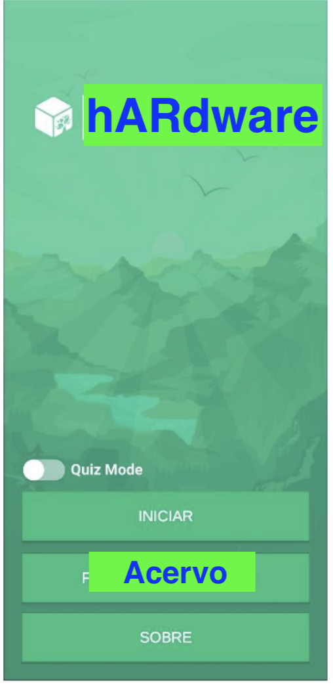
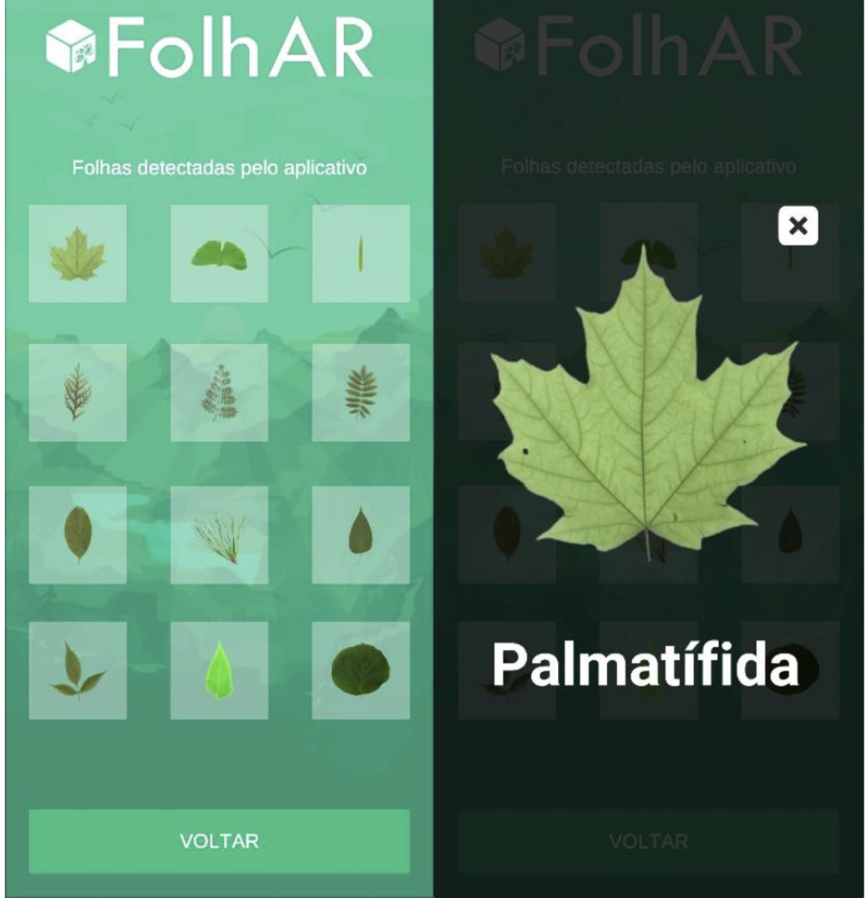
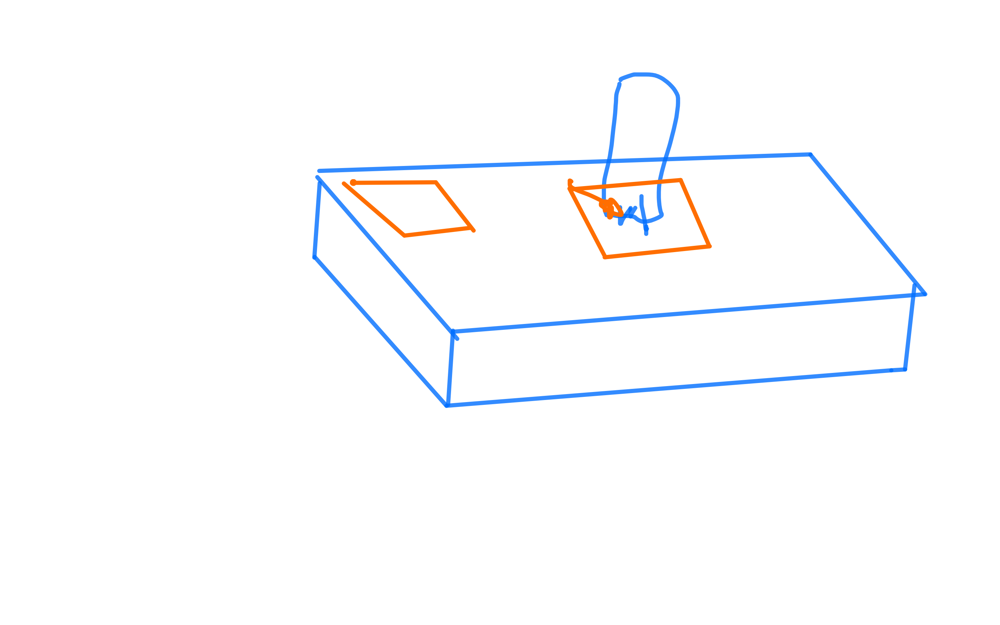
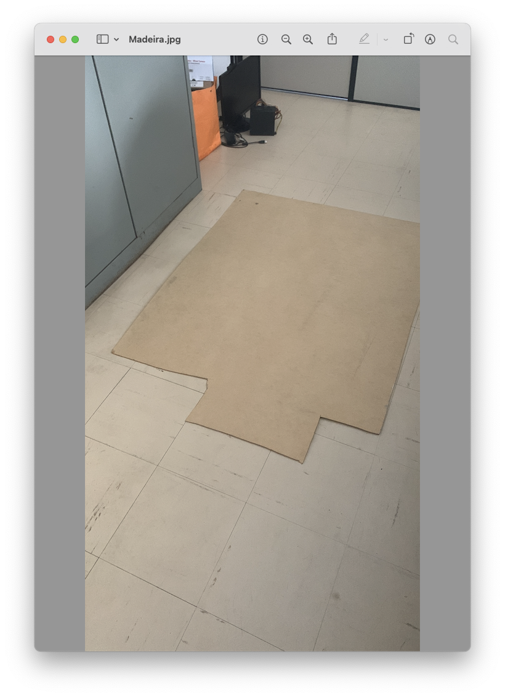
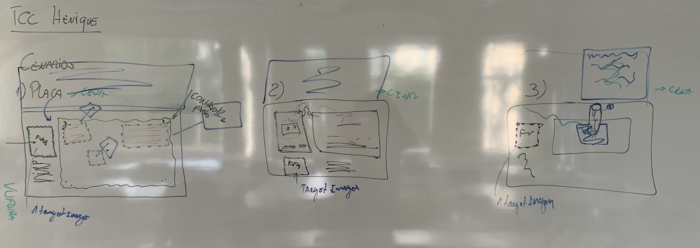

# Anotações das reuniões  

## 2022/08/18  

Concersamos sobre assuntos para TCC2. Chegamos a um assunto para Termo de TCC1.

## 2022/08/22

### [Termo](./Termo.pdf "Termo")  

## 2022-09-05 - 11:21

[2022-09-05_reuniao](2022-09-05_reuniao.pdf "2022-09-05_reuniao")  
[2022-09-05_reuniao_PreProjeto](2022-09-05_reuniao_PreProjeto.pdf "2022-09-05_reuniao_PreProjeto")  

## 2022-10-01 - 19:05

Primeira revisão do pré-projeto: [2022-09-30_PreProjeto_Dalton](2022-09-30_PreProjeto_Dalton.pdf "2022-09-30_PreProjeto_Dalton")  

## 2022-10-08 - 14:48

Segunda revisão do pré-projeto. Ainda tem ajsutes para serem feitos. CUIDADO com as citações e referências.  
[2022-10-08_PreProjeto_Dalton.pdf](2022-10-08_PreProjeto_Dalton.pdf "2022-10-08_PreProjeto_Dalton.pdf")  

## 2022-10-12 - 11:13

Pré-projeto: versão entregue para banca.
[2022-10-12_PreProjeto_Dalton](2022-10-12_PreProjeto_Dalton.pdf "2022-10-12_PreProjeto_Dalton")  

## 2022-11-08 - 17:30

Defesa do Pré-projeto.  
[2022-11-08_Slides.pdf](2022-11-08_Slides.pdf "2022-11-08_Slides.pdf")  
[2022-11-08_Slides.mp4](2022-11-08_Slides.mp4 "2022-11-08_Slides.mp4")  

## 2023-03-02 - 16:53

### Cenário

a) Válvula  
b) Placa Main  
c) CP-500 com fita K7  

  .. não Quiz  

Exemplo tutorial:
[TCCBrunoVigentas](https://github.com/gcgfurb/tcc_BrunoGeislerVigentas/blob/main/Textos/tcc_bcc_2021_1_bvigentas_BrunoGeiserVigentas-VF.pdf)

  
  

#### Telas

Pensar numa proposta de telas

- Tela abertura
- Tela Menu ()
- Tela catalogo (gride, arrastar, pesquisa)
- Tela RA

Ver exemplos prontos
<https://assetstore.unity.com/packages/essentials/ui-samples-25468>

### Teórica

  Cuidar com as anotações do Maurício: referências "fracas"  
  Tentar achar alguém que entende de museus: Péricas, Miguel, MuseuBio, .. fora da FURB.
  Testar 06/05/2023: [RetroSC](RetroSC.pdf)
  
### Prática - Unity

Versão do Unity (TLS):  

#### Geral

#### Específico

a) Vuforia
09/03: baixar última versão Unity LTS. Refazer o HelloWorld com Vuforia 1 marcador + cubo).  

b) Testar novos marcadores de acordo com o cenário.  

## 2023-03-10 - 09:25

Tentou fazer a placa ser um Tagert Image mas não conseguiu. A imagem da placa deu 4 estrelas no Vuforia.  
Definimos em ter 3 cenários:

- Cenario1: interagir com a placa MainBoard por botões virtuais para exibir informações.  
- Cenario2: animação entre CP-500 e tocar de fita para mostrar transferência de dados.  
- Cenario3: mover a válvula para poder "soltar" o inseto e resolver o problema do Bug. Ter uma imagem com um código com erro matriz "Me ajdue, meu código está com erro ... socorro :-)", quando tirar válvula fica preto, e depois o código funciona .. pode escrever uma mensagem agradecendo por ter arrumado o problema.  

  

## 2023-03-16 - 16:45

Fechamos os cenários. Deixe a madeira com o Henrique.  
  
  

Vai implementar o primeiro cenário.  
O prof. Migue autorizou pegar o CP-200 e gravador para fazer o cenário 2.  
Dalton: achar uma válvula.  

Resposta para O que é um bug que se tornou recurso de um programa? por Ericles Lima

## 2023-04-15 - 11:26

Tem primeiro protótipo da cena_1.  
Seguir para cena_3 (válvula).  
Fazer o Painel de mensagens usando TCC_Ricardo.  

Disse que pode usar o TCC do Ricardo: [AnimAR](../AnimAR/)  
[Monografia](../AnimAR/2018_1_ricardo-filipe-reiter_monografia.pdf)  

## 2023-05-08 - 18:42

Precisa terminar alguns pequenos ajustes de código no cenário placaMae.  
Prazo de uma semana para terminar programação do cenário válvula.  
```Dalton```: comprar a lâmpada que vai ser usada como válvula. De preferência com uma aparência de válvula, 12 volts e no sugar do soquete ser de pinos.  
```Dalton```: SonoOff - achar de uma baia só. Achar código Unity (C#) para SonoOff.  

## 2023-05-09 - 10:05

<video src="valvulas.mp4" controls title="Title"></video>  

## 2023-06-22 - 16:59

<video src="2023-06-22_CenarioBug.mp4" controls title="Title"></video>
